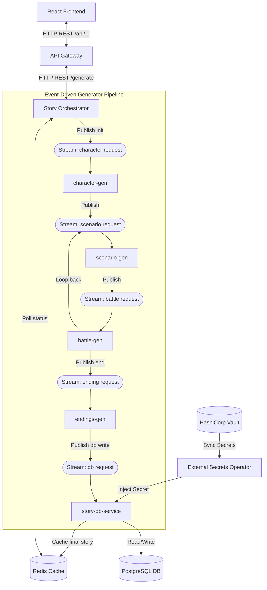

# Minecraft Story Generator (Microservices Simulation)

An event-driven, text-based multiplayer Minecraft adventure simulator built on a highly decoupled microservices architecture. The application simulates virtual players joining a server, generating relationships, encountering environmental challenges, battling legendary bosses, and working toward epic endings.

---

## Architecture Diagram

The application consists of a React frontend and 8 distinct backend microservices communicating asynchronously using **Redis Streams** as the message broker, with caching layered in **Redis Cache** and persistent storage handled by **PostgreSQL** (packaged via Helm). Secrets are dynamically retrieved from **HashiCorp Vault** using the **External Secrets Operator (ESO)**.

---

## System Services

### Core Frontend & Routing
*   **Frontend (React + Vite):** Serves the user interface. It renders the narrative with a typewriter effect, maintains a scrolling game chat pane, displays live player badges (health, location, inventory), and allows rating/commenting on saved stories.
*   **API Gateway (Flask, Port 5000):** The single ingress point. It forwards requests to the Orchestrator, manages story publishing, and caches the database directory lists (`all_stories`) inside Redis for 60 seconds.
*   **Story Orchestrator (Flask, Port 5015):** Starts the generation cycle. It creates a unique UUID `correlation_id`, publishes the initial state payload to `stream:character:request`, and polls Redis Cache (`story:<correlation_id>`) to return results to the polling frontend.

### The Pipeline Generator Microservices
*   **Character Gen (Flask, Port 5011):** Spawns 3 to 5 players with gamer tags (e.g. `xX_NoobSlayer_Xx`, `GamerNoob`, `RedstoneGod`), assigns health (20 HP), picks locations, defines personalities, and sets random initial relationship scores.
*   **Scenario Gen (Flask, Port 5012):** Tracks time of day (Morning $\rightarrow$ Afternoon $\rightarrow$ Night). Triggers event scenarios such as wrong tool arguments, base sabotage, reputation-based theft, or map exploration (e.g. desert temple) depending on the group's current inventory.
*   **Battle Gen (Flask, Port 5013):** Executes combat logic. If a threat (e.g. Herobrine, Wither, or Charged Creeper) is spawned, it calculates damage, processes teammate ditching (which harms relationships), handles death drops, and evaluates player retaliation. If no threat is present, it processes environmental accidents (like falling in lava).
*   **Endings Gen (Flask, Port 5014):** Concludes the adventure. If all players are dead, it triggers a game over. If they reach 10 rounds, it writes a victory ending (e.g. slaying the Ender Dragon). It then compiles the separate event snippets into a single continuous, readable markdown transcript.

### Database & Security
*   **Story DB Service (Flask, Port 5002):** Connects to the database (SQLite for local runs, PostgreSQL in production). It listens for completed stories on `stream:db:request` to cache them in Redis and provides endpoints to comment and rate published stories.
*   **HashiCorp Vault & ESO:** High-value database credentials are stored securely in Vault. The External Secrets Operator retrieves these secrets and mounts them as native Kubernetes Secrets, which are then injected as environment variables in the deployment container.